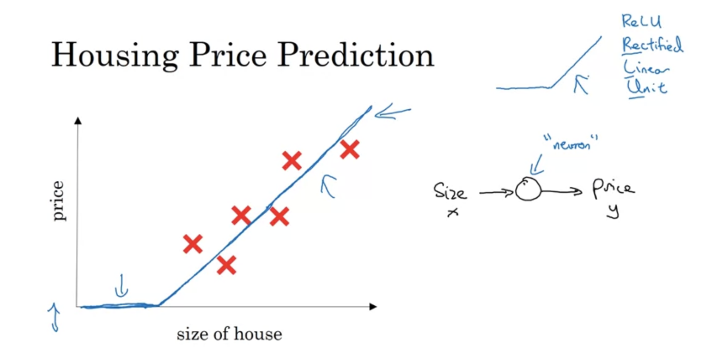
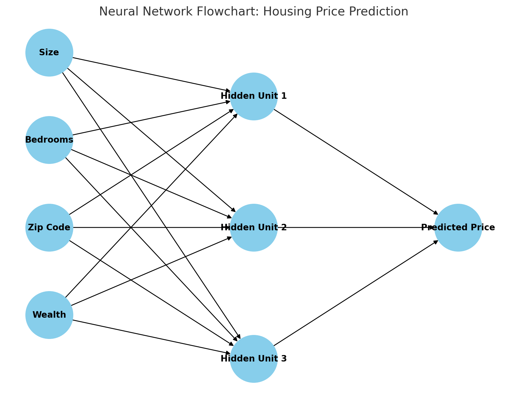
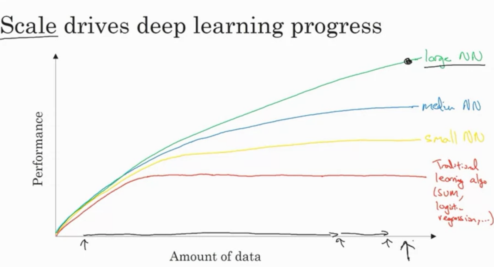

# Neural Networks and Deep Learning - Housing Price Prediction Example

## Introduction
- **Deep Learning** involves training **Neural Networks**, often large ones.
- A **Neural Network** is composed of many small computational units called **neurons**.
- Let's develop basic intuitions using a **Housing Price Prediction** example.

## Housing Price Prediction Example
- Assume we have a dataset with **6 houses** where:
  - We know the **size** of the houses in square feet or meters.
  - We know the **price** of the houses.
  - Goal: Predict house price as a function of its size.
  
### Linear Regression
- A possible approach: Fit a **straight line** to this data.
  - While it works initially, it can predict **negative prices** for very small sizes.
  
### Modified Approach
- Instead of a simple straight line, we can **bend the curve** at zero, ensuring the price never goes below zero.

## A Simple Neural Network
- The function that fits the housing price prediction is essentially a **very simple neural network**.

### Components of the Neural Network:
- **Input (x)**: The size of the house.
- **Output (y)**: The price of the house.
- **Neuron**: A single **node** that takes the input (x), computes a function, and outputs the predicted price (y).

#### Neuron Function:
- It computes a **linear function** of the input, applies a **maximum of 0** to avoid negative values, and outputs the predicted price.
- This is a simple case of a **ReLU (Rectified Linear Unit)** function.

### ReLU (Rectified Linear Unit) Function:
- ReLU outputs **0** for negative inputs and outputs the **input itself** for positive inputs.
  - This is why the curve bends at zero and continues as a straight line.

## Extending to Larger Neural Networks
- A **larger neural network** is formed by stacking together many such simple neurons.
- **Example**: Instead of predicting the price just based on the size, consider other **features**:
  - **Number of bedrooms** (#bedrooms).
  - **Family size** (whether the house fits a family of 3, 4, etc.).
  - **Zip code** or **postal code** (indicating features like walkability, wealth, or school quality).

### Structure of a Larger Neural Network:
- Each of these features can be modeled by individual neurons that predict specific properties:
  - **Family size** → determined by house size and number of bedrooms.
  - **Walkability** → influenced by the zip code.
  - **School quality** → influenced by zip code and wealth.

- Final output: **Price prediction** based on all these factors.
  
## Neural Network Structure:
- **Inputs (x)**: All the features (size, bedrooms, zip code, wealth).
- **Outputs (y)**: The predicted price.
- **Hidden Units**: Neurons between the input and output layers that learn intermediate representations of the data.

### Dense Connections:
- Every input feature is connected to **every neuron** in the hidden layer.
- Neural networks are **densely connected** as all inputs contribute to all hidden units.

### Neural Network Learning:
- Given enough data about **input features (x)** and **output (y)**, neural networks are good at figuring out functions that map inputs to outputs.

## Conclusion
- A **neural network** with multiple layers of neurons can model complex relationships between inputs and outputs.
- This setup is often used in **supervised learning**, where the goal is to map inputs (x) to outputs (y).

---

## Highlights:
- **ReLU Function**: Important activation function that outputs zero for negative inputs and the input itself for positive values.
- **Densely Connected Layers**: Every input is connected to every neuron in the hidden layer.
- **Supervised Learning**: Neural networks are especially powerful in scenarios where there are clear input-output relationships (like housing price prediction).

---------

---------
# Neural Networks and Their Impact on Supervised Learning

## Introduction
- **Neural Networks** have gained a lot of hype, much of which is justified due to their effectiveness.
- Most of the **economic value** from neural networks has come from **supervised learning**.

### Supervised Learning:
- In supervised learning, you have an **input (x)** and want to learn a function mapping to an **output (y)**.
- Example: **Housing Price Prediction**, where features of a home are input, and the price (y) is estimated.
  
## Applications of Neural Networks
1. **Online Advertising**:
   - Input: Information about the ad and the user.
   - Output: Predicting if the user will click on an ad.
   - Significance: **Highly lucrative** application, directly impacting the revenue of online advertising companies.

2. **Computer Vision**:
   - Input: Image data.
   - Output: Classifying the image into one of many categories.
   - Example: **Photo Tagging** systems.

3. **Speech Recognition**:
   - Input: Audio clips.
   - Output: Transcribing speech into text.

4. **Machine Translation**:
   - Input: Sentence in one language.
   - Output: Translation into another language (e.g., English to Chinese).

5. **Autonomous Driving**:
   - Input: Images (e.g., camera data) and radar data.
   - Output: Predicting the position of other cars on the road.

## Neural Network Architectures for Different Tasks
- **Standard Neural Networks**: 
  - Suitable for tasks like **real estate prediction** or **online advertising**.
  
- **Convolutional Neural Networks (CNNs)**:
  - Specialized for **image data**.
  - Recognizes patterns in spatial data (e.g., pixels in an image).
  
- **Recurrent Neural Networks (RNNs)**:
  - Used for **sequence data**, such as audio or text.
  - RNNs are particularly useful for time-dependent data, such as speech or language processing.

## Structured vs. Unstructured Data
### Structured Data:
- Examples: 
  - Housing price prediction, where features like house size, number of bedrooms, and zip code are well-defined.
  - Online ad click prediction, using user demographics and ad properties.
  
- **Structured Data**: Data that is organized in a clearly defined format, like databases or spreadsheets.

### Unstructured Data:
- Examples:
  - **Audio, images, and text** data where the input is less organized (e.g., pixel values, raw audio).
  
- Historically, **unstructured data** was harder for machines to interpret than structured data, but neural networks have made **major strides** in this area.
  
## The Rise of Neural Networks in Unstructured Data
- The ability of neural networks to handle unstructured data has enabled new applications like:
  - **Speech recognition**
  - **Image recognition**
  - **Natural language processing (NLP)**

- **Exciting Progress**: Neural networks' ability to recognize objects in images (e.g., identifying a cat) is widely celebrated due to our natural empathy for unstructured data.

### Economic Value in Structured Data:
- Though unstructured data gets more media attention, a lot of **economic value** comes from improvements in:
  - **Advertising systems**
  - **Product recommendations**
  - Processing **large databases** for better predictions.

## Key Takeaways:
- **Neural networks** have transformed supervised learning and are contributing **economic value** across many industries.
- They are useful for both **structured** and **unstructured data**, with numerous applications in **advertising, vision, speech, translation, and driving**.

## Conclusion:
- While the **technical ideas** behind neural networks have been around for decades, only recently have they become an incredibly powerful tool.
- In the next video, the reasons behind their recent success and power will be explored.

---
---
# Why Deep Learning is Taking Off

## Introduction
- **Deep learning** has recently seen a tremendous rise, but the core technical ideas have been around for decades.
- Understanding the reasons behind this surge can help identify opportunities to apply deep learning in various fields.

## The Data-Performance Relationship
- If we plot **data size** (x-axis) against **algorithm performance** (y-axis), we can visualize the effectiveness of various learning algorithms.

### Traditional Algorithms (e.g., SVM, Logistic Regression):
- Initially, as you add more data, the performance of these algorithms improves.
- However, after a certain point, their performance **plateaus**.
- Traditional algorithms are not well-suited for handling **large amounts of data**.

### Rise of Data Availability:
- Over the last two decades, there has been a dramatic increase in the amount of data due to:
  - **Digital activities**: Increased time spent on websites, apps, and digital platforms.
  - **Sensor data**: Cameras, accelerometers, Internet of Things (IoT) devices.
- The explosion of data outpaced the capabilities of traditional algorithms.

## Neural Networks and Data Scaling
- **Small Neural Networks**: Perform similarly to traditional algorithms with small datasets.
- **Large Neural Networks**: Continue improving performance as more data is added, without plateauing.

### Key Observations:
1. **Big Neural Networks** are needed to take full advantage of large datasets.
2. **Scale** drives progress:
   - **Scale of the neural network** (more hidden units, parameters, and connections).
   - **Scale of the data** (larger datasets to train on).

### The Role of Scale:
- Increasing the size of the neural network or feeding it more data often leads to improved performance.
- However, this strategy only works to a certain extent due to:
  - **Data limitations**: Eventually, you run out of usable data.
  - **Training time**: Larger networks take longer to train.

## Labeled Data and Training Set Size
- In technical terms, the amount of data refers to **labeled data**: Training examples where both **input (x)** and **output (y)** are known.
- We denote the size of the training set by **m**, representing the number of labeled examples.

## Feature Engineering in Small Data Regimes
- With smaller datasets, the performance of neural networks is less predictable.
- In this regime, **feature engineering** and human expertise often play a larger role in improving performance than the choice of algorithm.
- For example, an SVM with well-engineered features might outperform a neural network in a small data setting.

## The Impact of Algorithmic Innovations
- As neural networks have grown in scale, **algorithmic innovations** have also played a critical role.
- One notable breakthrough: Switching from **sigmoid activation functions** to **ReLU (Rectified Linear Unit)**.
  - **Sigmoid functions** slow down learning because their gradient becomes almost zero in certain regions, leading to slow parameter updates.
  - **ReLU functions** maintain a gradient of 1 for positive inputs, enabling faster learning.

## Faster Computation and Experimentation
- **Computation speed** plays a crucial role in training neural networks.
- Faster training allows for quicker experimentation, which is critical for:
  - Trying new neural network architectures.
  - Iterating on ideas more frequently.
  
### Faster Training Cycles:
- Shorter training times enable researchers to test multiple ideas quickly, boosting the pace of discovery.
- **GPUs** and other specialized hardware have played a big part in speeding up the training of larger neural networks.

## Ongoing Progress in Deep Learning
- **Data**: The digital world continues to produce increasing amounts of data.
- **Computation**: Advances in hardware (e.g., GPUs) and faster networking enable larger neural networks.
- **Algorithms**: Continuous innovation in neural network architectures and training techniques further enhances performance.

### Optimistic Outlook:
- The forces that have driven the rise of deep learning—**data**, **computation**, and **algorithms**—are still active, ensuring that deep learning will continue to improve for years to come.

---

## Highlights:
- **Data scaling** and **network size** are key drivers of deep learning progress.
- Algorithmic innovations like switching to **ReLU** have improved neural network performance by speeding up training.
- The rise of **specialized hardware** (e.g., GPUs) and faster training cycles has enabled more rapid experimentation and innovation.

