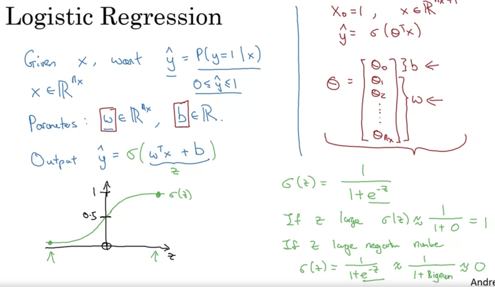
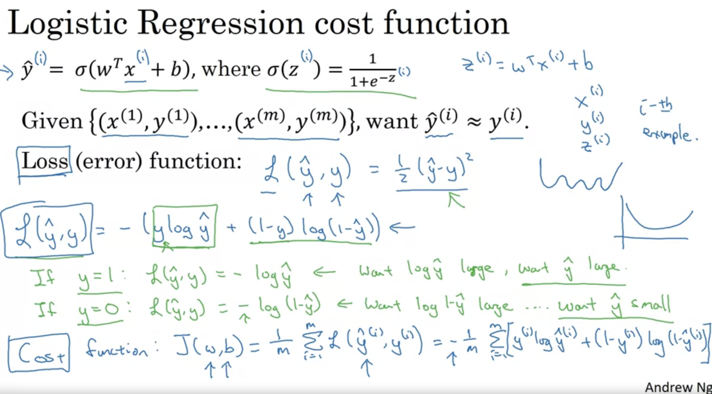

# Neural Network Programming Basics

## Overview
- This week covers the basics of **neural network programming** and introduces some key techniques.
- When implementing neural networks, certain practices make the process more efficient.
  
### Key Techniques:
1. **Avoiding explicit loops** over training examples:
   - When you have **m** training examples, instead of looping over them with a `for` loop, it's better to process the entire training set at once.
   
2. **Forward and Backward Propagation**:
   - Neural network computations are usually organized into two phases:
     - **Forward Propagation** (forward pass): Computing the output.
     - **Backward Propagation** (backward pass): Updating the model based on the error.

## Logistic Regression for Binary Classification
- To simplify the concepts, we'll use **logistic regression**, a binary classification algorithm.
  
### Binary Classification Example:
- **Input**: An image.
- **Output**: A label:
  - 1 = Cat
  - 0 = Not-cat
- **y**: The output label.

## Representing Images in a Computer
- Images are stored as three matrices (for **Red**, **Green**, and **Blue** color channels).
  - For example, a **64x64** image has three **64x64** matrices.
  
### Feature Vector (x):
- To use these matrices as input to an algorithm, the pixel values need to be **unrolled** into a **feature vector**.
  - If the image is 64x64, the feature vector **x** will have a length of **64 x 64 x 3 = 12,288**.
  - This is represented as **nx = 12,288**, where **nx** is the dimension of the input features.

### Binary Classification Goal:
- The goal is to learn a **classifier** that can take an image (represented as a feature vector **x**) and predict whether **y = 1** (cat) or **y = 0** (not-cat).

## Training Set Notation
- A single training example is represented as **(x, y)**:
  - **x**: Input feature vector.
  - **y**: Output label (0 or 1).
  
### Training Set:
- The training set contains **m** training examples: 
  - **(x₁, y₁)**, **(x₂, y₂)**, ..., **(xm, ym)**.
  - **m** is the number of training samples.
  
### Notation:
- **m_train**: Number of training examples.
- **m_test**: Number of test examples.

## Organizing Input Data into Matrices
- To process all training examples efficiently, we represent the entire dataset as matrices.

### Matrix X (Input Data):
- **X** is a matrix created by stacking the feature vectors of all training examples into columns.
  - **X = [x₁, x₂, ..., xm]**.
  - **X** will have **m** columns and **nx** rows.
  - The shape of **X** is **(nx, m)**, where:
    - **nx**: Dimension of the input feature vector.
    - **m**: Number of training examples.

### Matrix Y (Output Labels):
- Similarly, **Y** is a matrix created by stacking the output labels in columns:
  - **Y = [y₁, y₂, ..., ym]**.
  - **Y** will have a shape of **(1, m)**, where **m** is the number of training examples.

## Efficient Matrix Representation
- By stacking the input features (**X**) and output labels (**Y**) into matrices, we avoid using explicit loops, making the implementation more efficient.

### Python Representation:
- The matrix **X** has a shape of **(nx, m)**.
- The matrix **Y** has a shape of **(1, m)**.

### Why This Notation Matters:
- This notation simplifies the implementation of **logistic regression** and **neural networks**.
- For neural network programming, stacking training examples in columns (both for **X** and **Y**) will make computations easier and faster.

---

## Highlights:
- **Forward and Backward Propagation**: Key steps in neural network training.
- **Matrix Representation**: Organizing the input features (**X**) and output labels (**Y**) into matrices improves efficiency.
- **Avoid explicit loops**: Avoid looping over training examples individually; process them using matrix operations.

---
---

# Logistic Regression: A Binary Classification Algorithm

## Introduction
- **Logistic Regression** is used for **binary classification** where the output labels **Y** are either 0 or 1.
  - Example: Classifying an image as either a **cat (1)** or **not-cat (0)**.

### Goal:
- Given an **input feature vector X** (e.g., an image), we want to predict **Y hat** (the estimate of Y).
  - **Y hat** is the probability that **Y = 1** given **X**.
  - For example, Y hat represents the probability that a given image is of a cat.

## Model Representation

### Input and Parameters:
- **X**: An **nx-dimensional** feature vector (e.g., the unrolled pixel values of an image).
- **W**: An **nx-dimensional** vector of weights.
- **b**: A bias term (a single real number).
  
### Linear Combination of Inputs:
- One approach to predict Y hat could be to compute the linear combination: **WᵀX + b**.
  - This is similar to **linear regression**, but not suitable for classification, as the result can be greater than 1 or negative, which is not valid for probabilities.

### The Sigmoid Function:
- To ensure that **Y hat** lies between 0 and 1, logistic regression uses the **sigmoid function** to map the output of **WᵀX + b** to a probability.
  
- **Sigmoid Function**: 
  - Formula: 
    \[
    \sigma(z) = \frac{1}{1 + e^{-z}}
    \]
    Where **z = WᵀX + b**.

### Behavior of the Sigmoid Function:
- If **z** is large (positive), **sigmoid(z)** approaches **1**.
- If **z** is small (negative), **sigmoid(z)** approaches **0**.
- When **z = 0**, **sigmoid(z) = 0.5**.

### Plot of the Sigmoid Function:
- The sigmoid function is an **S-shaped curve**:
  - It smoothly transitions from **0** to **1**.
  - Crosses the y-axis at **0.5**.

## Logistic Regression Model
- **Y hat**: The estimated probability that **Y = 1** (i.e., the output of the sigmoid function).
- **W** and **b** are the parameters of the model that must be learned.

### Sigmoid Example:
- When **z** is a large positive number:
  \[
  \sigma(z) \approx 1
  \]
  - This corresponds to a high probability that **Y = 1**.
  
- When **z** is a large negative number:
  \[
  \sigma(z) \approx 0
  \]
  - This corresponds to a low probability that **Y = 1**.

## Alternative Notation (Not Used in This Course)
- In some courses, the bias term **b** is incorporated into the weight vector by introducing an extra feature **X₀ = 1**:
  - In this case, the parameters are represented as **θ = [θ₀, θ₁, ..., θₙₓ]**.
  - The model would then become:
    \[
    Y hat = \sigma(\thetaᵀX)
    \]
  - **θ₀** would replace the bias term **b**, and **θ₁, ..., θₙₓ** would correspond to **W**.
  
- **Note**: In this course, we will **not** use this convention. We will keep **W** and **b** as separate parameters for simplicity.

## Next Steps: The Cost Function
- To learn the parameters **W** and **b**, we need to define a **cost function**.
- The cost function will help us measure how well our model is performing and adjust **W** and **b** to improve predictions.

---
---

# Logistic Regression: Cost and Loss Function

## Recap of Logistic Regression Model
- The **output Y hat** in logistic regression is given by:
  \[
  Y hat = \sigma(W^\top X + b)
  \]
  Where **σ(z)** is the sigmoid function, mapping values to the range **[0, 1]**.

### Training Objective:
- The goal is to learn parameters **W** and **b** such that the predictions **Y hat** are close to the true labels **Y** for the training set.

## Loss Function (L)
- To measure how well the algorithm performs on a single training example, we define a **loss function**.
- **Loss Function (L)**: Measures how far **Y hat** is from the true label **Y**.

### Intuition Behind Loss Function:
- We want to minimize the difference between the predicted value **Y hat** and the true value **Y**.

### Issues with Squared Error:
- Using the squared error (common in linear regression) would result in a **non-convex optimization problem**, leading to multiple local optima.
- In logistic regression, we use a different loss function to ensure a **convex** optimization problem.

## Logistic Regression Loss Function
- The loss function used in logistic regression is defined as:
  \[
  L(Y hat, Y) = -\left[Y \log(Y hat) + (1 - Y) \log(1 - Y hat)\right]
  \]
  - **Y hat**: The predicted probability from the sigmoid function.
  - **Y**: The true label (either 0 or 1).

### Why This Loss Function Works:
- If **Y = 1**, the loss becomes:
  \[
  L(Y hat, Y) = -\log(Y hat)
  \]
  - This encourages **Y hat** to be as close to 1 as possible, minimizing the loss.
  
- If **Y = 0**, the loss becomes:
  \[
  L(Y hat, Y) = -\log(1 - Y hat)
  \]
  - This encourages **Y hat** to be as close to 0 as possible, minimizing the loss.

### Key Takeaway:
- The logistic regression loss function is designed to:
  - Maximize **Y hat** when **Y = 1**.
  - Minimize **Y hat** when **Y = 0**.

## Cost Function (J)
- While the loss function measures performance on a **single training example**, the **cost function** measures performance across the entire training set.

### Cost Function Formula:
- The **cost function J(W, b)** is the average loss over all training examples:
  \[
  J(W, b) = -\frac{1}{m} \sum_{i=1}^{m} \left[Y^{(i)} \log(Y hat^{(i)}) + (1 - Y^{(i)}) \log(1 - Y hat^{(i)}) \right]
  \]
  Where:
  - **m**: Number of training examples.
  - **Y hat^{(i)}**: The predicted output for the **i-th** training example.
  - **Y^{(i)}**: The true label for the **i-th** training example.

### Optimization Goal:
- To train the logistic regression model, we aim to find parameters **W** and **b** that **minimize the cost function J**.

## Summary:
- **Loss Function (L)**: Measures error on a single training example.
- **Cost Function (J)**: Measures the total error across all training examples.
- The objective in logistic regression is to minimize the cost function by adjusting **W** and **b**.
  
## Next Steps:
- In the next video, we will explore how **logistic regression** can be viewed as a very small neural network.

---
---
